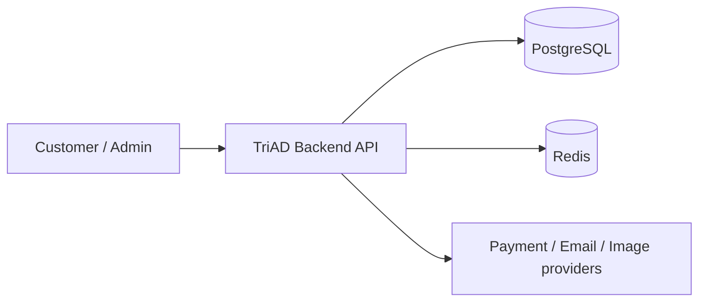
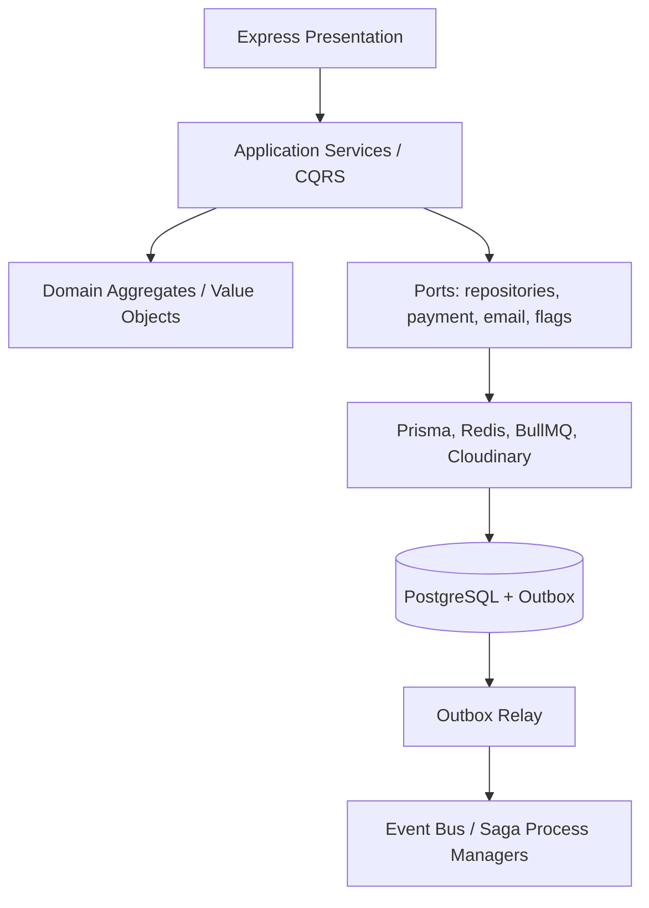
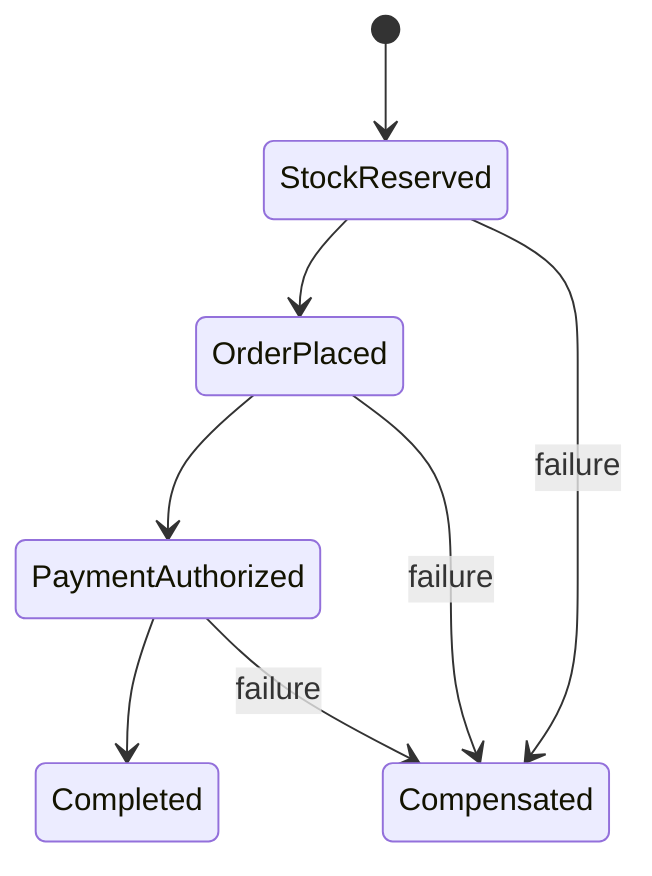

# TriAD Backend (DNEK)

**Production-ready E-Commerce Backend**  
**Tech Lead Level · Clean Architecture · Domain-Driven Design · High Reliability**

[](<>)
[](<>)
[](<>)
[](<>)
[](<>)
[](<>)
[](<>)
[](<>)

---

## 1. Architecture Overview

Dự án được thiết kế theo **Clean Architecture + Domain-Driven Design (DDD)** với các nguyên tắc cốt lõi:

- **Separation of Concerns** rõ ràng giữa Domain, Application, Infrastructure và Presentation.
- **Dependency Inversion** được thực thi nghiêm ngặt thông qua DI Container tùy chỉnh.
- **Domain Events + Transactional Outbox** để đảm bảo eventual consistency và reliability.
- **Idempotency**, **Optimistic Concurrency**, **Circuit Breaker**, **Rate Limiting**, **CSRF Protection**.
- **Observability** đầy đủ: Structured Logging (Winston), Metrics (Prometheus), Distributed Tracing (OpenTelemetry).

```
src/
├── core/                 # Infrastructure & Cross-cutting concerns
│   ├── di/               # Dependency Injection Container + Tokens
│   ├── database/         # Prisma client
│   ├── redis/
│   ├── queue/            # BullMQ
│   ├── outbox/           # Transactional Outbox + Handler Tracker
│   ├── circuit-breaker/
│   ├── health/
│   ├── metrics/
│   ├── tracing/
│   ├── logger/
│   ├── storage/          # Cloudinary
│   └── unit-of-work/
├── modules/              # Bounded Contexts (Vertical Slices)
│   ├── auth/
│   ├── users/
│   ├── products/
│   ├── cart/
│   ├── checkout/
│   ├── orders/
│   ├── reviews/
│   ├── wishlist/
│   ├── notifications/
│   └── admin/
├── shared/               # Shared Kernel
│   ├── domain/           # AggregateRoot, DomainEvent, DomainError
│   ├── value-objects/    # Money, Rating
│   ├── middlewares/
│   ├── utils/
│   └── constants/
├── jobs/                 # Background jobs (Email, Image Processing)
├── config/
├── app.ts
├── container.ts
└── server.ts
```

### Bounded Contexts & Aggregates

| Bounded Context | Aggregate Root  | Key Domain Concepts                      |
| --------------- | --------------- | ---------------------------------------- |
| Auth            | User            | RefreshToken family, 2FA (TOTP), OAuth   |
| Products        | Product         | Stock (optimistic locking), SearchVector |
| Cart            | Cart            | CartItem                                 |
| Checkout        | Order (pending) | Pricing, Stock Reservation, Idempotency  |
| Orders          | Order           | State Machine, PaymentStatus             |
| Reviews         | Review          | Rating Value Object                      |
| Wishlist        | WishlistItem    |                                          |
| Notifications   | Notification    |                                          |

---

## 2. Core Design Principles (Tech Lead Level)

### 2.1 Domain Layer (Pure & Rich)

- **Entities** và **Aggregate Roots** chứa encapsulation mạnh (`order.entity.ts`, `product.entity.ts`, `cart.entity.ts`, `user.entity.ts`).
- **Value Objects**: `Money`, `Rating` (immutable, self-validating).
- **Domain Events** được raise bên trong Aggregate và publish qua Outbox.
- **Domain Errors** thống nhất (`DomainError` hierarchy).

### 2.2 Application Layer

- Application Services / Use Cases mỏng, điều phối Domain + Infrastructure.
- Transactional boundary được quản lý bởi **Unit of Work**.
- Idempotency Key được enforce ở middleware + service level (checkout, order placement).

### 2.3 Infrastructure Layer

- **Repository** pattern (interface ở Domain/Application, implementation ở Infrastructure).
- **Transactional Outbox** + `outbox_handler_log` để đảm bảo at-least-once delivery và exactly-once per handler.
- **Circuit Breaker** (Opossum) bảo vệ external services.
- **Optimistic Concurrency Control** (`version` field trên Product & Order).

### 2.4 Cross-cutting Concerns

- Structured logging với request correlation.
- Prometheus metrics + custom business metrics.
- OpenTelemetry tracing (Jaeger / OTEL Collector).
- Rate limiting (Redis store) + strict rate limit cho auth endpoints.
- CSRF protection, Helmet, input validation (Zod).

---

## 3. Key Production Features

| Feature                | Implementation                                        | Status |
| ---------------------- | ----------------------------------------------------- | ------ |
| Transactional Outbox   | `outbox_events` + `outbox_handler_log` + Relay        | ✅     |
| Idempotency            | Redis + Idempotency-Key header + DB unique constraint | ✅     |
| Optimistic Locking     | `version` column + Prisma updateMany                  | ✅     |
| Stock Reservation      | Checkout flow với reservation service                 | ✅     |
| 2FA (TOTP)             | Speakeasy + encrypted secret                          | ✅     |
| Refresh Token Rotation | Family-based rotation + revocation                    | ✅     |
| Full-text Search       | PostgreSQL `tsvector` + GIN index                     | ✅     |
| Background Jobs        | BullMQ (Email, Image processing)                      | ✅     |
| Health Checks          | Liveness + Readiness (DB, Redis, Queue)               | ✅     |
| Observability          | Winston + Prometheus + OpenTelemetry                  | ✅     |
| Docker & Compose       | Multi-stage Dockerfile + prod compose                 | ✅     |

---

## 4. Testing Strategy

```bash
# Unit tests (fast, isolated)
npm run test:unit

# Integration tests (real DB + Redis via Testcontainers)
npm run test:integration

# Full suite
npm test
```

- **Unit tests**: Domain logic, Services, Value Objects, Middlewares (high coverage).
- **Property-based testing**: `Money`, Order state machine, Product stock (fast-check).
- **Integration tests**: Repository layer, concurrent checkout scenarios, Outbox.
- **Testcontainers** cho PostgreSQL & Redis → test gần production environment.

---

## 5. Getting Started

### Prerequisites

- Node.js ≥ 20
- Docker & Docker Compose
- PostgreSQL 16 + Redis 7 (hoặc dùng docker-compose)

### Local Development

```bash
# 1. Clone & install
git clone <repo>
cd triad-backend
npm install

# 2. Environment
cp .env.example .env
# Điền DATABASE_URL, REDIS_URL, JWT secrets, Cloudinary, OAuth credentials...

# 3. Database
npx prisma migrate dev
npm run seed

# 4. Start services
docker-compose up -d postgres redis jaeger

# 5. Run
npm run dev
```

API sẽ chạy tại `http://localhost:5000`  
Swagger: `http://localhost:5000/api-docs`  
Jaeger UI: `http://localhost:16686`

### Production

```bash
docker-compose -f docker-compose.prod.yml up -d --build
```

---

## 6. Project Structure Highlights (OOP / Clean Code)

- **DI Container** tùy chỉnh với token-based resolution (`src/core/di`).
- **Aggregate Root** base class quản lý domain events.
- **Unit of Work** pattern cho transaction boundary.
- **Specification** pattern trong Products (search, filter).
- **Strategy** pattern cho OAuth providers và Payment methods (dễ mở rộng).
- **Middleware chain** rõ ràng, có request scope.
- **Mapper** tách biệt giữa Domain Entity ↔ Persistence ↔ DTO.

---

## 7. Security Checklist

- [x] Password hashing (bcrypt)
- [x] JWT Access + Refresh Token (rotation + family revocation)
- [x] 2FA (TOTP)
- [x] Rate limiting (global + auth strict)
- [x] CSRF protection
- [x] Helmet + CORS config
- [x] Input validation (Zod)
- [x] Idempotency keys
- [x] Sensitive data redaction in logs
- [x] Secure headers & cookie settings

---

## 8. Observability & Operations

- **Health**: `/health`, `/health/ready`
- **Metrics**: `/metrics` (Prometheus)
- **Tracing**: OpenTelemetry → OTEL Collector / Jaeger
- **Logging**: Winston + Daily Rotate + structured JSON
- **Outbox monitoring**: dead-letter + attempts tracking

---

## 9. Architecture Decision Records

### ADR-001: Modular Monolith trước Microservices

Các bounded context được tách bằng module, port và DI ngay trong một process. Cách này giữ transaction boundary và local debugging đơn giản khi team còn cần thay đổi domain nhanh; Outbox và Saga tạo khả năng tách service sau này mà không buộc hệ thống trả giá vận hành microservices quá sớm.

### ADR-002: Transactional Outbox + CQRS read ports

Domain events được ghi cùng transaction với aggregate. Relay claim event bằng `SKIP LOCKED` và lease trước khi publish, nên nhiều instance không xử lý cùng row trong một lease. Catalog, Dashboard và Order History dùng read-only ports, giữ nguyên API response trong khi có thể thay adapter bằng projection/materialized view.

### ADR-003: Saga cho workflow phân tán

Checkout và Cancellation/Refund là process manager có state machine, resume và compensation. Payment, inventory và email được biểu diễn qua ports để adapter thật có thể thêm timeout, retry, circuit breaker và bulkhead mà không làm bẩn domain.

## 10. Diagrams

### C4 Context



### C4 Container



### C4 Component: Checkout



## 11. Reliability and Verification

- `CheckoutSaga` and `CancellationRefundSaga` have unit fault-injection tests, persisted state and compensation paths.
- Production factories wire both Sagas to the PostgreSQL `saga_states` store; tests continue to inject the in-memory port.
- `.github/workflows/quality-gates.yml` runs typecheck, OpenAPI contract verification, unit tests, build and the Outbox chaos probe.
- `ops/prometheus/alerts.yml` contains sample rules for outbox lag, delivery failures and stock reservation failures.
- Run `npm run typecheck`, `npm run test:unit`, and `npm run test:integration` before deployment.

Remaining production integration work is intentionally adapter-specific: a real payment provider contract, a durable saga state adapter, Pact/OpenAPI consumer verification, and CI chaos jobs require the deployment environment and frontend contract. The ports and state machines keep those additions isolated from the domain.

---

## 10. License & Author

**TriAD Backend** – Internal / Private  
Architected for production reliability, maintainability and team scalability.

---

> **Philosophy**:  
> Code is written once, read and maintained many times.  
> Domain purity, explicit boundaries, and operational excellence are non-negotiable.

```

```
