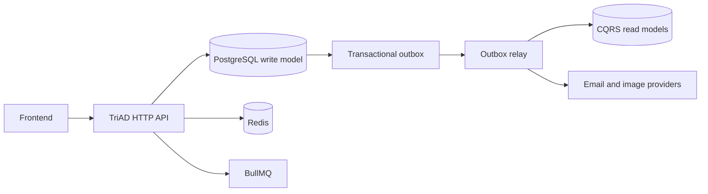
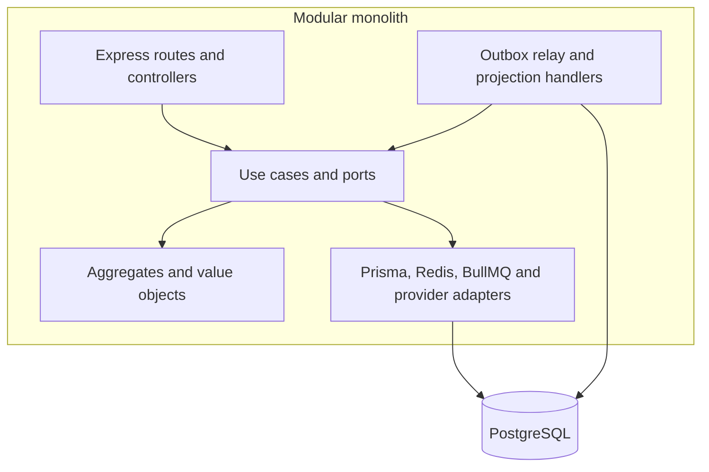
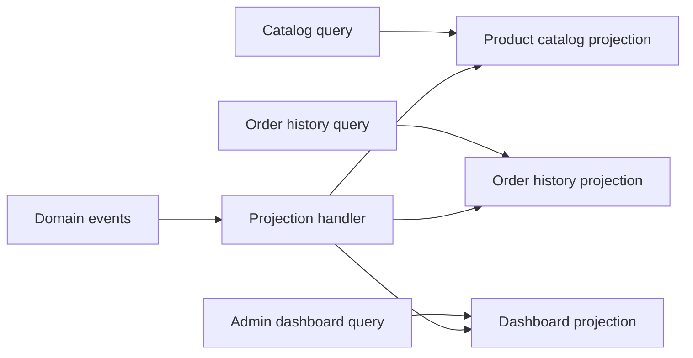

# TriAD Backend Architecture

## Context



## Containers



## Components



## Decisions

### ADR-001: Modular monolith

Bounded contexts remain modules in one deployable process. This preserves local transactions and keeps operational cost low while ports, events and outbox records leave a future service boundary explicit.

### ADR-002: Transactional outbox

Aggregate changes and event records commit in one database transaction. The relay uses leases and handler execution logs, so delivery is at-least-once while each registered handler is idempotent per event.

### ADR-003: CQRS projections

Catalog, order history and dashboard have dedicated projection tables. Query adapters read those tables; write repositories remain responsible for commands. Projections are eventually consistent, which is preferred over coupling frontend reads to aggregate joins.

### ADR-004: Saga orchestration

Checkout and cancellation use persisted state, per-step timeout/retry policy, an overall deadline and compensating actions. Compensation operations must be idempotent because retries and process recovery are expected behavior.

### ADR-005: Hexagonal boundaries

Domain code depends only on domain types and application ports. Prisma, Redis, queues and external providers are adapters selected by the composition root.

## Trade-offs

- Read models add migration and replay responsibility and are eventually consistent.
- Outbox and Saga reliability require operational monitoring for lag, dead letters and stuck state.
- A modular monolith gives simpler transactions but does not provide independent scaling per bounded context.

## Operations

```bash
npm install
docker compose up -d postgres redis
npm run prisma:migrate:deploy
npm run seed
npm run dev
```

Validation gates:

```bash
npm run typecheck
npm run lint
npm run test
npm run test:integration
npm run test:contract
npm run test:chaos
```

Production uses `docker-compose.prod.yml`. Monitor `/health`, `/health/ready`, `/metrics`, outbox lag, dead-lettered events and Saga states. The frontend should use the documented Swagger contract at `/api/docs`; CORS origins are configured through `CORS_ORIGIN` in production.